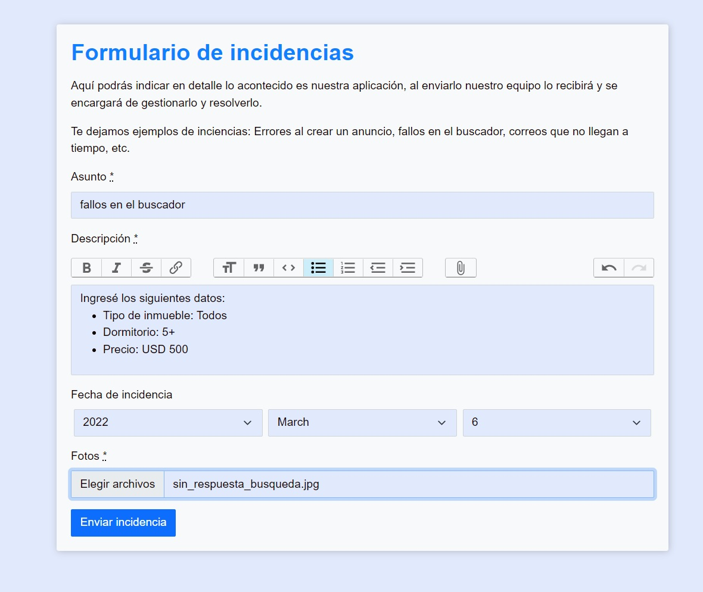
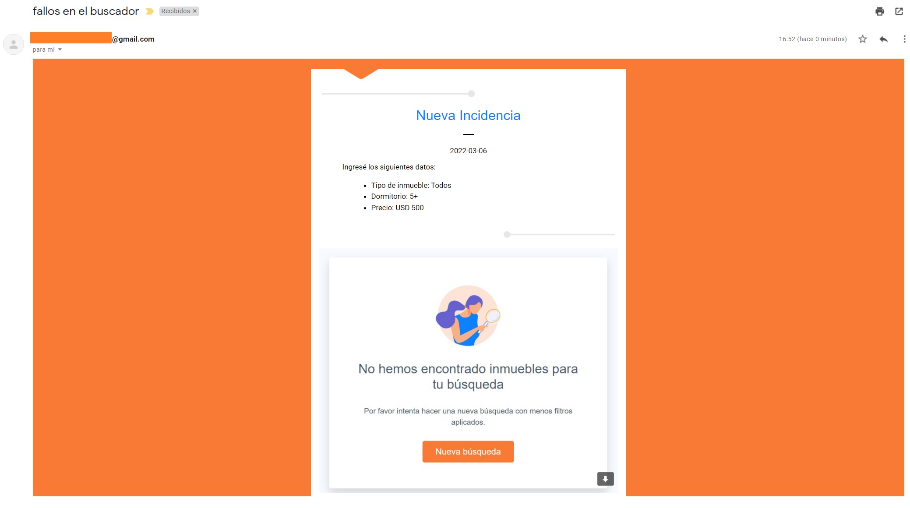

# Envío de incidencia a correo del PO

## Instrucciones de instalación:

1- Clonar el repositorio (en consola): 
```bash
git clone git@github.com:verenisseeyzaguirre/incident-mailer.git
```

2- Ubicarse en la carpeta creada (en consola): 
```bash
cd incident-mailer
```

3. Instalar las dependencias (en consola):
```bash
bundle install
yarn install
```

4. Crear y migrar BBDD  (en consola):
```bash
rails db:create db:migrate
```

5. Crear archivo .env  (en consola):
```bash
touch .env
```

6. Crear la siguiente variables de entorno y llenar con datos propios luego del "="(dentro de archivo .env):
```bash
GMAIL_ADDRESS=from@example.com
GMAIL_PASSWORD=qwerttyyu
MAIL_TO=to@example.com
CLOUDINARY_URL=cloudinary://qwertyu
```
Para generar GMAIL_PASSWORD ingrese a: https://support.google.com/mail/answer/185833?hl=en
y obtener tu CLOUDINARY_URL creese una cuenta en: https://cloudinary.com/

7. Correr el servidor (en consola):
```bash
rails s
```

6. Accede a la aplicación ingresando al navegador mediante http://localhost:3000/


## Vistas de aplicación

1. Al ingresar a http://localhost:3000/ 
 
 
 2. Luego de llenado los inputs requeridos y enviados ocurren 2 acciones:
 - Reporte
 
 -Mail
 


